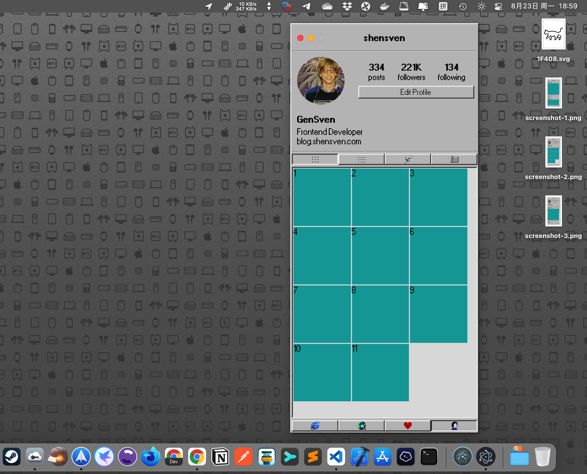
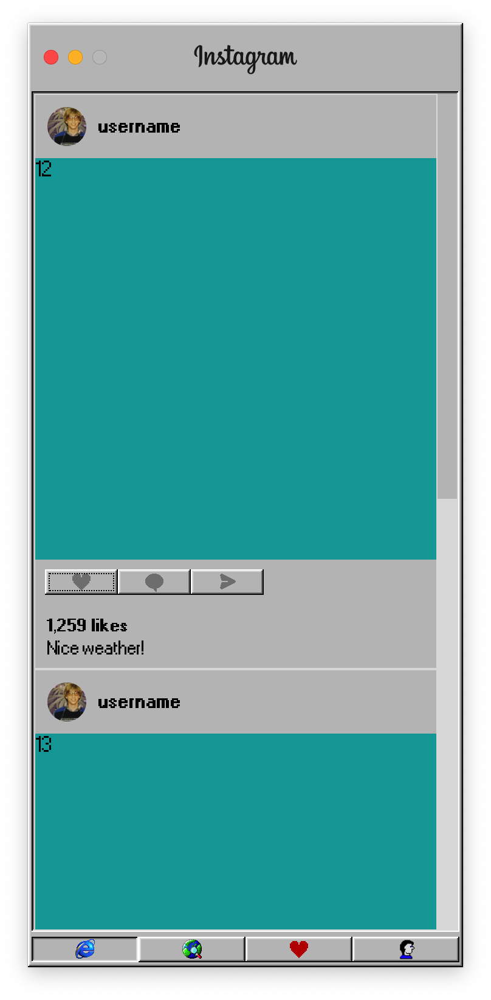
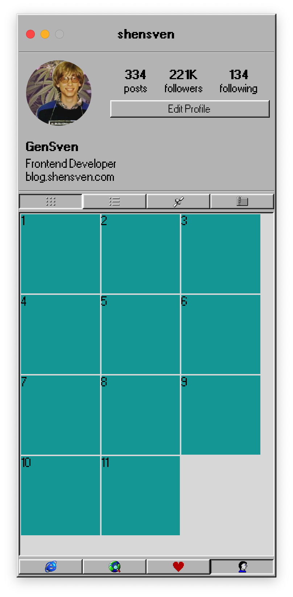
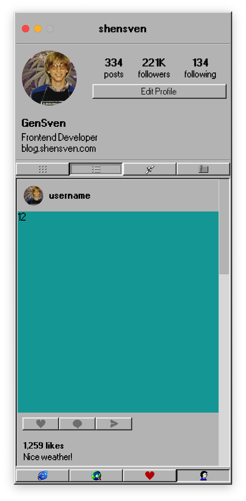

# Winstagram 98

An Instagram desktop dreamed back to 1998

## Preview

|  |  |  |
| :-------------------------------------------------: | :-------------------------------------------------: | :-------------------------------------------------: |
